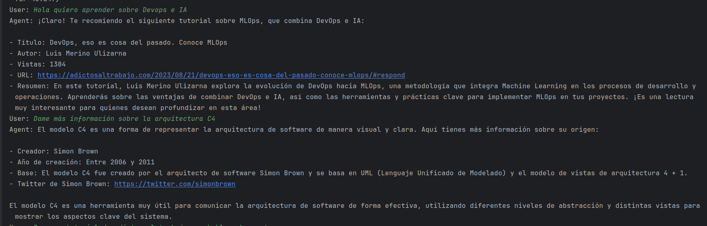
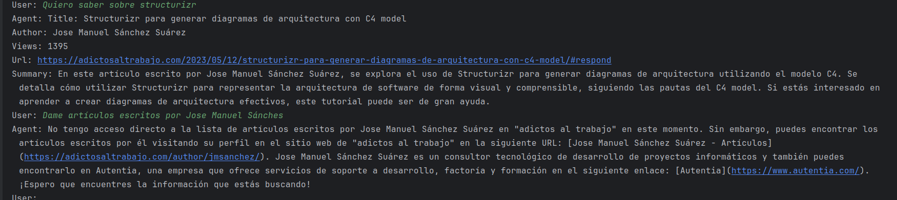

# 🚀 Langchain agent with Java and SpringBoot

¡Bienvenidos a **Adictos al Trabajo**! 😎 Este es el lugar donde la inteligencia artificial y la pasión por la
información se fusionan. 🤖💡

## ¿Cómo funciona por dentro?

**LangChain** es una biblioteca de procesamiento de lenguaje natural (NLP) en Java que permite crear aplicaciones
contextuales y conversacionales. https://www.langchain.com/

**Spring Boot** es un marco de desarrollo para aplicaciones Java que simplifica la
creación de servicios RESTful. https://spring.io/projects/spring-boot

Por otro lado, **OpenAI** proporciona una API para acceder a modelos de lenguaje
avanzados, como GPT-3. Además, LangChain4j ofrece una integración específica para
OpenAI. https://platform.openai.com/api-keys

## Ejemplos de ejecución

--- 

