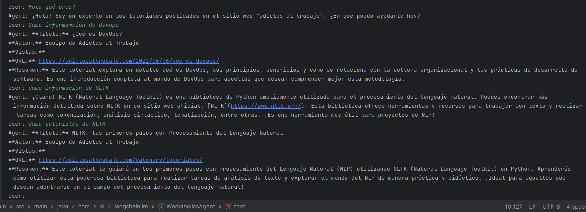
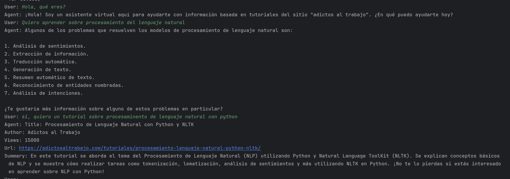

# 🚀 Langchain agent with Java and SpringBoot

Este es un agente realizado con Java, SpringBoot. Langchain y GPT 3.5 especializado en tutoriales del portal adictos al
trabajo mediante la técnica [RAG](https://aws.amazon.com/es/what-is/retrieval-augmented-generation/) (Retrieval
Augmented Generation).

Código realizado siguiendo los pasos del tutorial de José Manuel
Sánchez [LangChain4j: Potenciando tus aplicaciones Java con Inteligencia Artificial (IA) y Modelos de Lenguaje de Gran Escala (LLM)](https://adictosaltrabajo.com/2024/03/05/langchain4j-potenciando-tus-aplicaciones-java-con-inteligencia-artificial-ia-y-modelos-de-lenguaje-de-gran-escala-llm-primeros-pasos/)

Este artículo explora cómo LangChain4j puede mejorar tus aplicaciones Java mediante la integración de inteligencia
artificial y modelos de lenguaje avanzados como GPT-3.5

## ¿Cómo funciona por dentro?

**LangChain** es una biblioteca de procesamiento de lenguaje natural (NLP) en Java que permite crear aplicaciones
contextuales y conversacionales. https://www.langchain.com/

**Spring Boot** es un marco de desarrollo para aplicaciones Java que simplifica la
creación de servicios RESTful. https://spring.io/projects/spring-boot

Por otro lado, **OpenAI** proporciona una API para acceder a modelos de lenguaje
avanzados, como GPT-3. Además, LangChain4j ofrece una integración específica para
OpenAI. https://platform.openai.com/api-keys

## Ejemplos de ejecución

--- 

---

